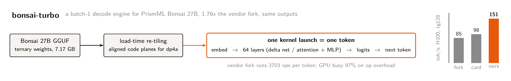

<p align="center">
  
</p>

# bonsai-turbo

A batch-1 decode engine for PrismML's Bonsai 27B (ternary and 1-bit GGUF packs) on NVIDIA GPUs. It replaces the vendor's llama.cpp fork for token generation and produces the same outputs, faster. The whole per-token pass runs as one CUDA graph launch, or as one single cooperative kernel.

## Results (H100 80GB SXM, tg128, batch 1, greedy)

| engine | ternary tok/s | 1-bit tok/s |
|---|---|---|
| vendor llama.cpp fork, measured on the same machine class | 85.5 +/- 6.9 | 90.1 +/- 3.5 |
| vendor published numbers | 98.0 | 104.8 |
| bonsai-turbo, CUDA graph mode | 151.1 | 133.0 |
| bonsai-turbo, megakernel (`--mega`) | 149.6 | **158.7** |

That is 1.76x the vendor fork measured on identical hardware, and up to 1.53x their published H100 numbers. The 1-bit pack reads half the weight bytes per token, so its megakernel is the fastest engine here. Every number in this table was measured. Nothing is projected.

Correctness is gated before speed. Logit parity passes on 32 of 32 fixed prompts against the vendor fork, for all four engine configurations (ternary and 1-bit, CUDA graph and megakernel): greedy top-1 is identical at every step, except ties where the vendor's own top-1/top-2 margin was at most 0.034. Pre-divergence top-20 logit deltas stay inside the measured cross-engine int8 noise floor of about 1.2. Run it yourself with `scripts/parity.sh`.

On a MATH-500 subset the engine solves 97% of the problems it finishes (64 of 66 completed traces graded correct in the best run so far). The remaining problems did not terminate inside the token budget, which is a sampling and budget question, not a kernel one. The logit-parity result above already establishes that the kernels reproduce the vendor's output distribution.

## Why it is faster

We profiled the vendor fork on H100 using its own logs and NVML. It executes 3703 graph ops per decoded token and the GPU is 97% busy. So batch-1 decode is not bound by launch gaps or bandwidth. It is bound by the execution overhead of thousands of tiny sequential ops.

The roofline says there is room. One token reads 6.83 GB of weights. At the H100's measured 3.0 TB/s that allows roughly 440 tok/s. The fork gets 85. bonsai-turbo closes part of that gap with:

1. Load-time re-tiling. GGUF's 34-byte blocks become 16-byte aligned code planes plus scale planes, with codes permuted so they feed `dp4a` directly (`src/retile.cpp`).
2. One templated GEMV family for both packs, at 78 to 80% of measured copy peak on the large shapes (`src/cuda/gemv.cu`).
3. Projection stacking. The delta-net projections, the attention q/k/v, and the MLP gate/up each become a single GEMV at load time.
4. A fused gated-delta-net step and a flash-decode attention kernel.
5. The whole token step captured as one CUDA graph, or compiled as one cooperative kernel (`src/cuda/mega.cu`) where kernel boundaries become grid syncs.

## Quickstart

Any Linux machine with an NVIDIA GPU and the CUDA toolkit. No cloud account needed.

```bash
# 1. weights (about 11 GB; needs `pip install huggingface_hub`)
./scripts/fetch_weights.sh

# 2. the vendor fork, for baseline and parity comparison (pinned SHA)
./scripts/build_vendor_fork.sh          # CUDA_ARCHS=120 for RTX 5090
./scripts/bench_baseline.sh

# 3. bonsai-turbo
cmake -B build -G Ninja && cmake --build build -j
ctest --test-dir build

# 4. generate (token ids in and out; tokenize with the fork's llama-tokenize)
./build/bt-run --model weights/Ternary-Bonsai-27B-Q2_0.gguf \
    --ids 9707 --n 128 --bench --graph
# sampled generation: add --temp 1.0 --top-k 20 --top-p 0.95 --seed 42

# 5. gates and the comparison table
./scripts/parity.sh
./scripts/bench_ours.sh && python3 scripts/make_table.py
```

Or run everything in one shot: `./scripts/repro.sh`.

The maintainers run these same scripts on cloud GPUs through thin wrappers in `infra/modal/`. The engine does not depend on them.

## Repo layout

```
src/            loader, pack formats, weight re-tiling
src/cuda/       kernels: gemv, delta net, attention, elementwise, megakernel
tools/          bt-run (the engine CLI), bt-inspect, bt-microbench, parity probes
scripts/        fetch, build, bench, parity gate, MATH-500 harness, repro
tests/          bit-exactness tests for dequant and re-tiling
infra/modal/    optional cloud wrappers used by the maintainers
docs/assets/    the header diagram (LaTeX source + build script)
```

## Current limitations

- The KV cache is fp16. This matches the vendor's fastest measured config: their 4-bit KV mode benched slower on their own fork (82.7 vs 85.5 tok/s here). In-attention q4 dequant is planned.
- The 1-bit GEMV runs in graph and megakernel modes. Its roofline ceiling is about twice the ternary one, so there is more speed to recover with a wider unpack.
- No RTX 5090 numbers yet. Our cloud provider has no 5090s. `CUDA_ARCHS=120` is wired; measurements welcome.
- Decode only, batch 1 only. Prompt processing is sequential. Greedy and top-k/top-p sampling.
- The DSpark speculative drafter is not integrated yet.

## Model facts (verified against sources)

| item | value | source |
|---|---|---|
| ternary pack | `Q2_0_g128`: fp16 scale + 32 B codes per 128 weights, 2.125 bpw, 7.17 GB | HF model card + fork `ggml-common.h` |
| 1-bit pack | `Q1_0_g128`: fp16 scale + 16 B codes per 128 weights, 1.125 bpw, 3.8 GB | HF model card + fork `ggml-common.h` |
| parity reference | F16 GGUF, 53.8 GB | HF repo tree |
| backbone | Qwen3.6-27B hybrid: 64 layers, gated delta net everywhere except full attention every 4th layer (16 of 64), GQA, QK norm, gated Q | fork `src/models/qwen35.cpp` |
| context | 262K | model card |
| vendor H100 baseline | 98.0 tok/s ternary, 104.8 tok/s 1-bit (tg128) | HF model cards |
| vendor RTX 5090 baseline | 134 tok/s ternary, 163 tok/s 1-bit | vendor launch post |
| MATH-500 | F16 99.40, ternary 99.20, 1-bit 98.00 | HF model cards |

## License

Apache 2.0. This repo contains no vendor code. The PrismML llama.cpp fork is cloned at build time for baseline comparison only.
